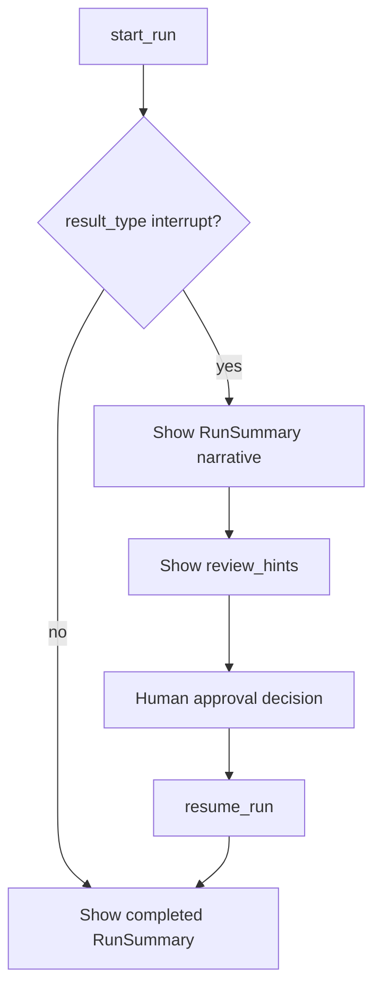

# Review UX Notes (Phase 7)

Guidance for presenting GroundSealWorkflowRuntime output to human reviewers without building a full UI.

## Primary Review Surfaces

1. **Interrupt response** — show `interrupt.node_id`, `interrupt.message`, and diagnostic `review_hints`.
2. **Run summary text** — `format_run_summary_text()` for console or ticket attachments.
3. **Diagnostic JSON** — `DiagnosticReport.model_dump_json()` for structured review tools.

## Recommended Review Flow

## What Reviewers Need

| Question | Where to look |
|----------|---------------|
| Why paused? | `summary.workflow_phase`, `interrupt.reason` |
| What completed? | `summary.nodes` |
| Safe to resume? | `invariant_status == ok`, checkpoint list |
| Who approved? | `RunState.context.approver_id` after resume |

## Anti-Patterns

- Dumping full `RunState.context` to reviewers (may contain sensitive data).
- Hiding checkpoint version — reviewers need it to detect stale resume attempts.
- Replacing structured errors with generic "something went wrong" messages.

## Phase 7 Non-Goals

- Web dashboard or approval UI components.
- Real-time streaming diagnostics.

These remain parent platform responsibilities; this subsystem supplies the report schema.
